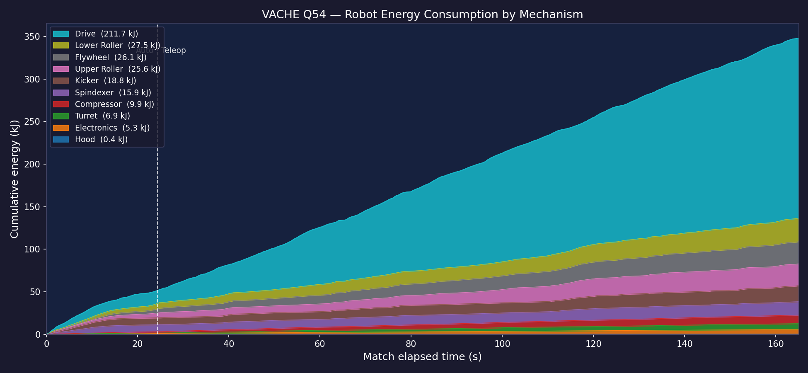
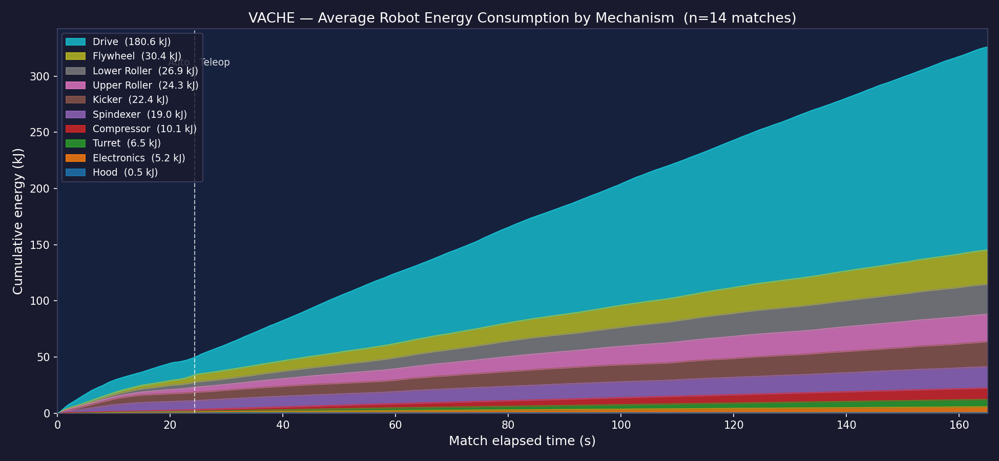

# Robot Energy Consumption — VACHE 2026

Energy is computed as ∫ V·I dt per mechanism, using PDH battery voltage and
per-mechanism supply current from AdvantageKit logs. Drive uses motor-controller
reported currents (8 Krakens). Overhead electronics (OrangePis, LEDs, RIO, radio,
CANivore, coprocessors) are sourced from PDH channel data since no AK entries
exist for those loads.

---

## Q54 — Single Match

| Mechanism | Energy | Share |
|-----------|-------:|------:|
| Drive | 211.7 kJ | 61.7% |
| Lower Roller | 27.5 kJ | 8.0% |
| Flywheel | 26.1 kJ | 7.6% |
| Upper Roller | 25.6 kJ | 7.5% |
| Kicker | 18.8 kJ | 5.5% |
| Spindexer | 15.9 kJ | 4.6% |
| Compressor | 9.9 kJ | 2.9% |
| Turret | 6.9 kJ | 2.0% |
| Hood | 0.4 kJ | 0.1% |
| **Total** | **342.8 kJ** | |

Q54 was a high-energy match — drive consumption was notably higher than the
event average, consistent with aggressive teleop movement.

---

## VACHE Average — 14 Competition Matches (Q4–Q58, E4/E8/E10)

Q13 excluded (incomplete — auto only). Each match aligned to t = 0 at
autonomous enable; curves averaged on a common 165 s grid.

| Mechanism | Avg Energy | Share |
|-----------|----------:|------:|
| Drive | 180.6 kJ | 55.4% |
| Flywheel | 30.4 kJ | 9.3% |
| Lower Roller | 26.9 kJ | 8.3% |
| Upper Roller | 24.3 kJ | 7.4% |
| Kicker | 22.4 kJ | 6.9% |
| Spindexer | 19.0 kJ | 5.8% |
| Compressor | 10.1 kJ | 3.1% |
| Turret | 6.5 kJ | 2.0% |
| Electronics | 5.2 kJ | 1.6% |
| Hood | 0.5 kJ | 0.2% |
| **Total** | **326.1 kJ** | |

---

## Key Observations

**Drive dominates.** At 55–62% of total energy, the drivetrain is by far the
largest consumer. All growth is approximately linear, indicating sustained
driving throughout both auto and teleop with no extended idle periods.

**Shooter system is the second-largest group.** Flywheel + rollers (Lower/Upper)
+ Kicker + Spindexer collectively consume ~113 kJ on average (35%), nearly all
of which is teleop — the bands for these mechanisms steepen noticeably after the
auto/teleop boundary as the shooter spins up and cycles continuously.

**Compressor is non-trivial.** At ~10 kJ (3%), the compressor ranks above the
turret. The pneumatic system runs throughout the match to maintain pressure.

**Electronics overhead (5.2 kJ, 1.6%)** covers OrangePis, LEDs, RIO, radio,
CANivore, and coprocessors. The ~1.5 A constant draw on PDH channels 14–15
(OrangePis/LEDs) accounts for roughly 60% of this group, with the remainder
split across channels 20–22 (RIO, radio, CANivore/coprocessors).

**Hood is essentially idle (0.4–0.5 kJ, <1%).** The hood is set to position at
the start and rarely moves during a match.
